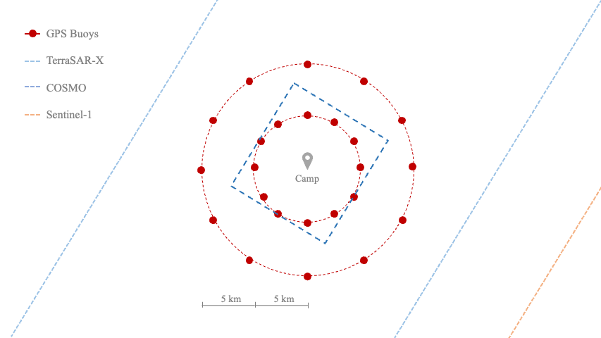
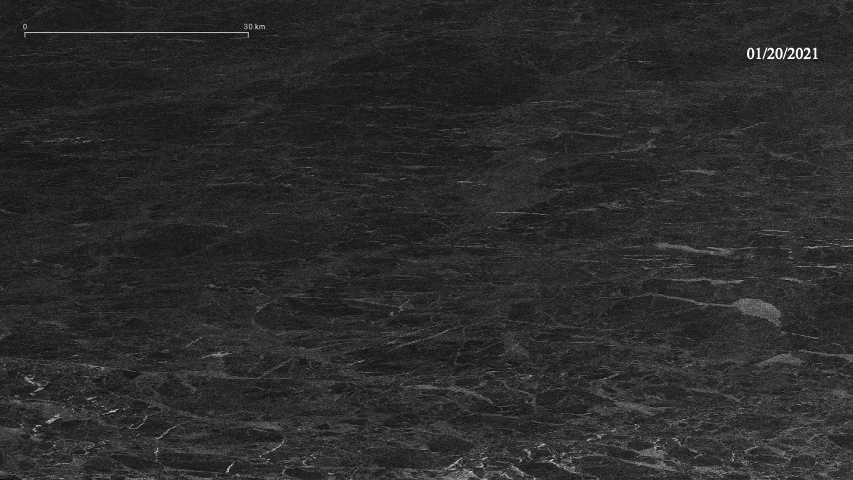
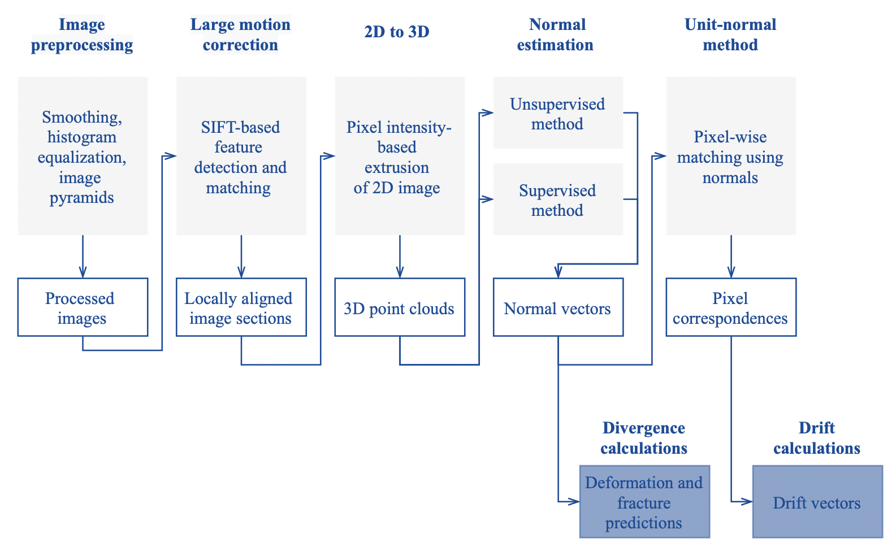

## Projects

* * *

### SIDEx

In March 2021 a distributed array of sensors and platforms will be deployed in an ice floe in the Beaufort Sea off the Alaskan coast to monitor sea ice stress, strain and drift over several months.

I will be part of the ground support team, providing sea ice fracture and lead formation analysis from satellite data to the field team during the field campaign.  My primary role is developing sea ice motion analysis products using integrated satellite and buoy GPS data that will be used for advancing our knowledge of the fine-scale strain and stress dynamics of sea ice under the influence of atmospheric, wave and ocean forces.

_Field camp layout and remote sensors_

A combination of Sentinel-1 and MODIS satellite imagery will be used to track lead and crack formation around the camp. The ground support team will provide the field team with daily reports of the sea ice drift and fracture based on manual analysis.

_Sentinel-1 imagery from the month of January 2021 showing an example of a 10 x 10 km camp area._

_Processing pipeline being developed for motion analysis algorithm._

You can see the full project presentation [here](./Projects.pdf).

* * *

### MOSAiC

In collaboration with the Sea Ice Dynamics and SAR Drift and Deformation Teams, we are developing algorithms for drift and deformation analysis along with methods for fracture and lead formation prediction using Sentinel-1 data. 

See more about the MOSAiC Expedition [here](https://mosaic-expedition.org/).

* * *

### SCALE

A six week expedition in the Spring of 2019 to the MIZ in the Antarctic aboard the S.A. Agulhas II. 

_The S.A. Agulhas II icebreaker in the Southern Ocean during the Scale Expedition._

The goal of the project was to record seasonal cycle dynamics in the Southern Ocean in order to improve understanding of climate sensitivity. On board were 97 participants across 17 nationalities from 19 different scientific institutions. Read more [here](https://www.sanap.ac.za/spring-cruise-2019-onboard-the-s-a-agulhas-ii).

I participated as a member of the Sea Ice Team from the University of Cape Town. My responsibilities included ice coring, sea ice observations, buoy troubleshooting and deployment and the operation and maintenance of the [Stereo Vision system](./thesis.pdf) I developed for my final honors project.

_Extracting ice cores during the 2019 SCALE Expedition. [Photo by Felix Paul]_

* * *

[back](./)
